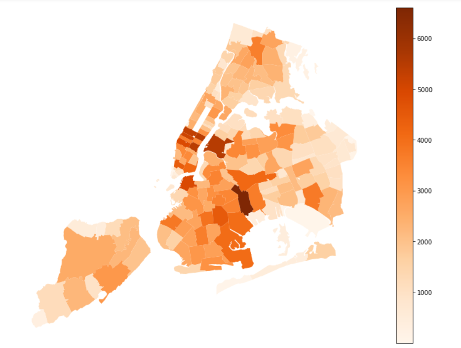

Clarity: The plot has no title and no description of the legend or the axes, so until you look at the caption, it is absolutely unclear what the choropleth is about. Also, the caption and the description below it should be merged as they both are just describing what the plot is about and both should be a part of the caption.

Esthetic: The colours seem to be able to portray a message but I think choosing a darker colour map might make it easier to look at since the lighter portions of the graph seem to almost get merged within the white backgound. So, either a different colormap or setting a frame should get rid of this issue.

Honesty: The plot seems to be representing the data accurately without doing some manipulations to emphasize the points it is trying to make.

Link to the actual plot: https://github.com/jz3309/PUI2018_jz3309/tree/master/HW8_jz3309
